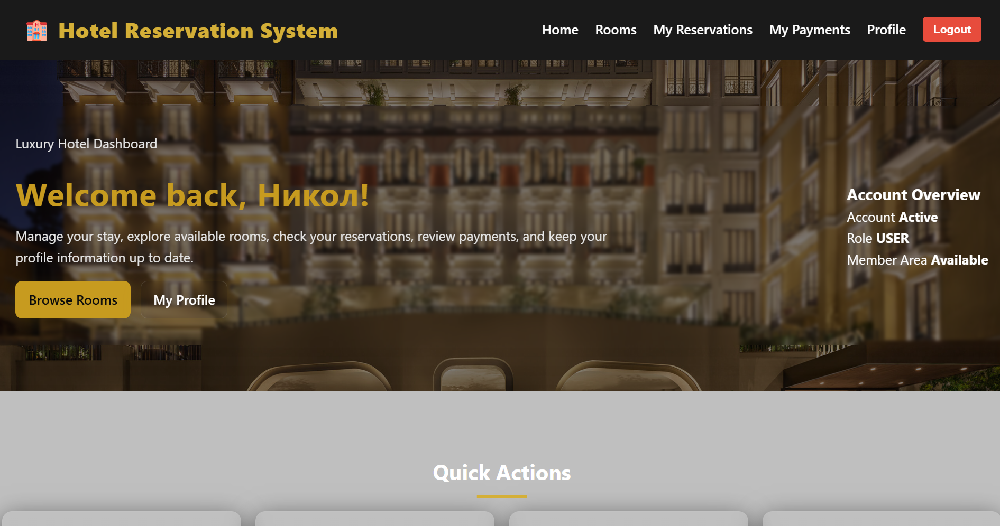
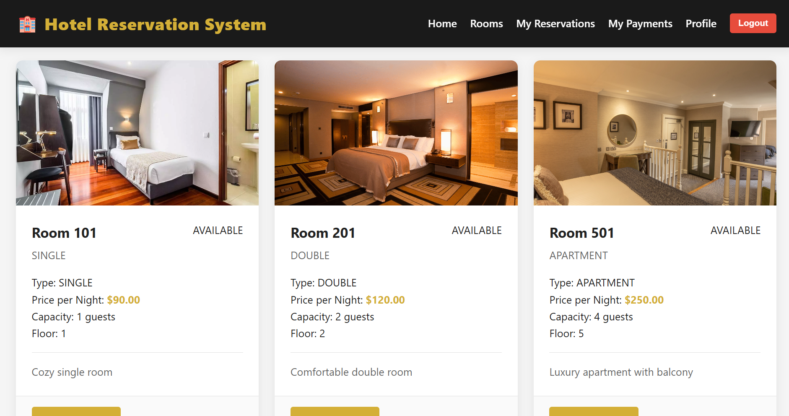
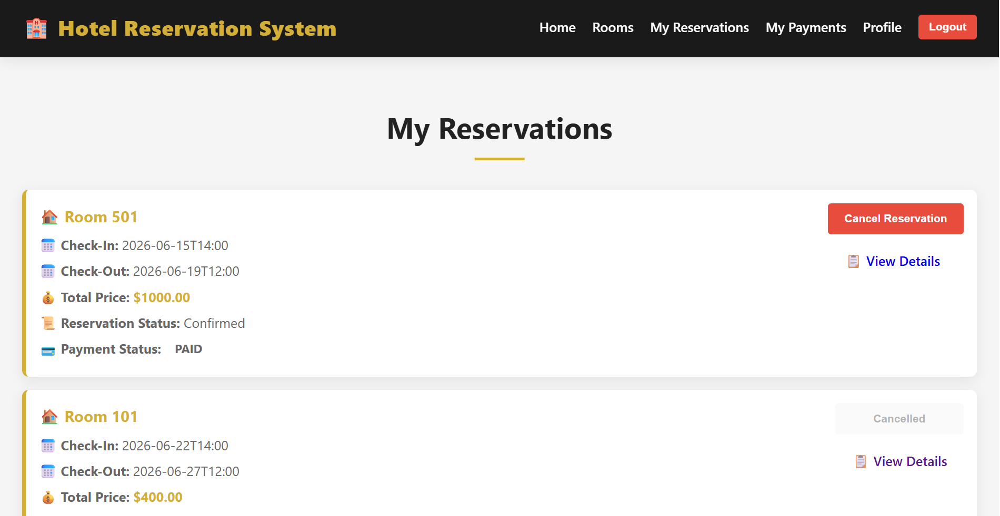
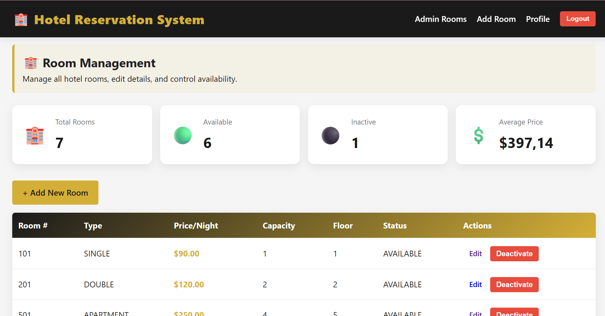
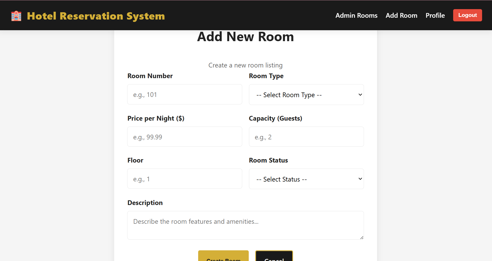

# 🏨 Hotel Reservation System

A modern hotel reservation platform built with **Spring Boot**, **Thymeleaf**, and **MySQL**. The application allows guests to browse available rooms, make reservations, manage their profile, and complete payments, while administrators can efficiently manage hotel rooms through a dedicated dashboard.



---

# What's This?

This project was developed as part of a university course to practice full-stack Java web development using the Spring ecosystem.

The application follows the **MVC architecture** and demonstrates authentication, authorization, CRUD operations, form validation, session management, database persistence, and role-based access control. The project also focuses on creating a clean user interface and providing a complete hotel reservation workflow from browsing rooms to managing bookings.

---

# Tech Stack

### Backend

- Java 21
- Spring Boot
- Spring MVC
- Spring Data JPA
- Hibernate
- Maven

### Frontend

- Thymeleaf
- HTML5
- CSS3
- JavaScript

### Database

- MySQL

---

# Features Worth Mentioning

## Authentication

Users can register and log into the system. Authentication is session-based and different parts of the application are accessible depending on the user's role.

- User registration
- User login
- Session authentication
- Role-based authorization
- Protected pages

---

## Room Search

Users can browse all available rooms and filter them using multiple criteria.

Supported filters include:

- Room type
- Maximum price
- Minimum capacity

Additional validation prevents impossible searches such as requesting five guests in a Double Room.



---

## Reservation System

Customers can reserve available rooms and manage their bookings through their personal account.

Features include:

- Room reservations
- Reservation history
- Reservation management
- Payment overview



---

## Admin Panel

Administrators have access to a dedicated dashboard for managing hotel rooms.

Available functionality includes:

- Add new rooms
- Edit room information
- Deactivate rooms
- Room statistics
- Capacity validation
- Custom confirmation modal before deactivating rooms

The dashboard also provides quick statistics including:

- Total rooms
- Available rooms
- Inactive rooms
- Average room price



### Add Room

The administrator can easily create new rooms using a validated form that prevents duplicate room numbers and invalid room capacities.



---

## Validation

The application contains multiple layers of validation to prevent invalid data.

Examples include:

- Required fields
- Duplicate room numbers
- Invalid room capacities
- Price validation
- Search validation
- Authorization checks
- Server-side validation

For example, administrators cannot create a Double Room with capacity for five guests, and users cannot search for impossible room combinations.

---

# User Interface

The project was designed with a clean and responsive interface.

Highlights include:

- Responsive navigation
- Custom admin dashboard
- Responsive room cards
- Responsive forms
- Success and error alerts
- Custom confirmation modal
- Consistent styling across all pages

---

# Running Locally

## Requirements

- Java 21
- Maven
- MySQL

Clone the repository:

```bash
git clone https://github.com/nikol65/hotel-reservation-system.git
```

Open the project in IntelliJ IDEA.

Create a MySQL database:

```text
hotel_reservation_system
```

Configure your own database credentials inside:

```text
src/main/resources/application.properties
```

Example:

```properties
spring.datasource.url=jdbc:mysql://localhost:3306/hotel_reservation_system
spring.datasource.username=root
spring.datasource.password=Root@0447
```

Run the application:

```bash
mvn spring-boot:run
```

or directly from IntelliJ.

The application will start on:

```text
http://localhost:8080
```

---

# What I Learned

This project helped me gain practical experience with the Spring Boot ecosystem and modern Java web development.

Throughout the development process I practiced designing layered applications using the MVC architecture, working with Spring Data JPA and Hibernate, implementing authentication and role-based authorization, performing CRUD operations, validating user input, managing sessions, and integrating a MySQL database.

I also improved my frontend skills by building responsive pages with Thymeleaf, HTML, CSS and JavaScript while focusing on creating a consistent user experience for both customers and administrators.

---

# Future Improvements

Possible future enhancements include:

- Email notifications
- Online payment integration
- Room image uploads
- Booking calendar
- Advanced reporting
- Docker deployment

---

# Author

**Nikol Dimitrova**

Built as a university learning project using Spring Boot and modern Java web technologies.
